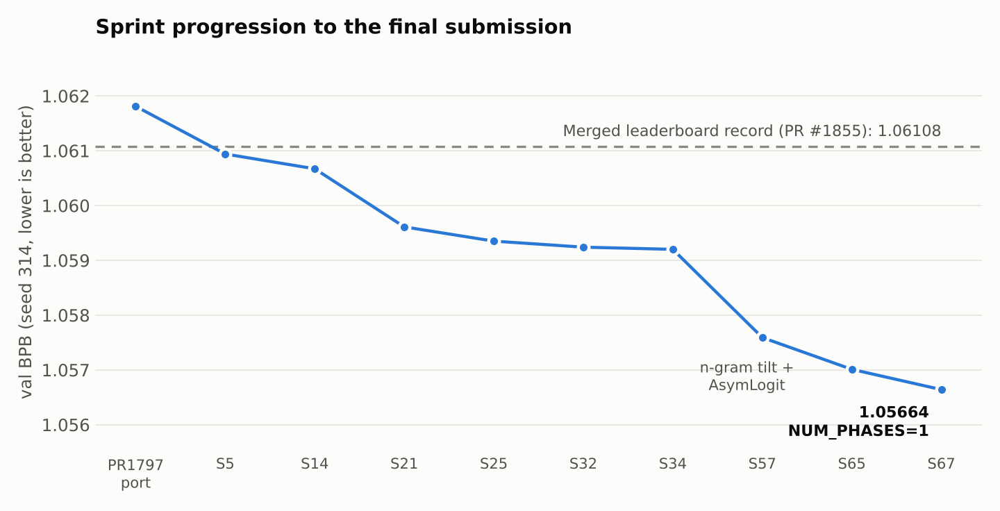

# 16MB Language Model — OpenAI Parameter Golf

**val_bpb 1.05670** (3-seed mean, std 0.00015) on FineWeb · 8×H100 SXM · 600s train / 600s eval · ≤15.95 MB artifact

My record-candidate submission to OpenAI's [Parameter Golf](https://openai.com/index/parameter-golf/) challenge: train the best language model that fits in 16MB, in 10 minutes on 8×H100s.

> **Status: result under review for a train/validation overlap.** After I submitted, an audit ([Issue #2127](https://github.com/openai/parameter-golf/issues/2127)) found that the shared `prepare_caseops_data.py` script defaults to `--val-docs=10000`. With that default, training shards start at document 10,000 while validation covers documents 0–50,000, so roughly 80% of the validation documents also appear in training. This submission inherited that default from the CaseOps / PR #1797 lineage it builds on, along with 14 other flagged submissions, and a maintainer recommended excluding it. **Treat 1.05670 as optimistic until it is re-run.** A clean re-run on the canonical disjoint split (`--val-docs=50000`) is planned.

- Submission PR: [openai/parameter-golf#2130](https://github.com/openai/parameter-golf/pull/2130)
- Full sprint history (173 run logs, every branch): [TanishGudise/parameter-golf](https://github.com/TanishGudise/parameter-golf)



## Results

| Seed | Pre-quant BPB | Quant BPB | **Post-TTT BPB** | Eval (s) | Artifact (bytes) |
|---|---|---|---|---|---|
| 314 | 1.06087 | 1.06924 | **1.05664** | 522.5 | 15,942,188 |
| 42 | 1.06063 | 1.06910 | **1.05655** | 533.1 | 15,948,872 |
| 0 | 1.06109 | 1.06958 | **1.05690** | 519.7 | 15,944,542 |
| **Mean** | 1.06086 | 1.06931 | **1.05670** | 525.1 | max 15,948,872 |

Every seed is under the 16,000,000-byte cap and the 600s eval budget, with a 67–80s margin.

## What I added

I built on the public SP8192 CaseOps / PR #1797 lineage. My contribution is the combination below, stacked and validated under the compute limits.

1. **Token-only n-gram tilt.** A closed-form, strictly causal tilt from an online token n-gram model, implemented as a C state machine (`online_ngram_state.c`). I ported it from a merged precedent (PR #1514) and disabled the within-word and word-start channels so only legal, target-independent hints fire. In the logs: `token_gate=628130 within_gate=0 word_gate=0`.
2. **AsymLogit Rescale.** Two trainable scalars (`softcap_pos`, `softcap_neg`) replace the fixed logit softcap and are adapted by global test-time training (TTT). By itself it made the un-adapted model slightly *worse*, but it gave TTT much more room to adapt: TTT recovered −0.01267 BPB instead of −0.01103.
3. **Fitting the time budget.** I moved the n-gram precompute (~167s) *inside* the eval timer for compliance, then had to fit it plus TTT (~355s) under 600s.
4. **The winning lever: `PHASED_TTT_NUM_PHASES=1`.** One global TTT pass instead of two. It improved BPB *and* cut eval time by ~49s, which turned an at-risk 571s run into a comfortable 522s.

## Ablations (60+ tracked runs, seed 314)

| Run | Change | Post-TTT BPB | Notes |
|---|---|---|---|
| Base | PR #1797 port | 1.06181 | starting point |
| S5 | K+O LoRA ablation, EMA 0.9975 | 1.06094 | |
| S14 | PR #1855 TTT bundle, MLP LoRA on | 1.06067 | below #1855's 3-seed mean on 1 seed |
| S15 | + BOS SmearGate leak fix | 1.06196 | **regressed**: other hparams compensated for the leak |
| S21 | NUM_PHASES=2 | 1.05961 | |
| S25 | K-LoRA off (O + MLP only) | 1.05935 | |
| S30 | 2 gradient steps per chunk | 1.07313 | **catastrophic** overshoot |
| S32 | TTT weight decay 2.0 | 1.05924 | |
| S33 | NUM_PHASES=3 | 1.05982 | more phases hurt |
| S34 | eval seq len 2560 | 1.05920 | |
| S35 | + TTT LoRA LR 7.5e-5 | 1.05883 | **142KB over the size cap**, discarded |
| S57 | n-gram tilt + AsymLogit | 1.05759 | biggest single jump |
| S65 | precompute inside eval timer | 1.05701 | compliant, 571.7s eval |
| S66 | TOKEN_ORDER=8 | 1.05989 | worse *and* 632.9s (over budget) |
| **S67** | **NUM_PHASES=1** | **1.05664** | final config, 522.5s |

**Takeaways**
- TTT configuration mattered more than architecture tweaks late in the sprint.
- Fixes that were "correct" in isolation (the BOS leak fix) can regress a tuned stack.
- The constraints decide the winner. The best-BPB run (S35) was illegal on size, and the final lever won because it saved time.

## Model and stack

| Component | Setting |
|---|---|
| Model | 11 layers, 512d, 8 query / 4 KV heads, MLP 4× |
| Tokenizer | SP8192 CaseOps (lossless caps), byte-sidecar BPB accounting |
| Attention | Partial RoPE (16 dims), XSA on all layers, SparseAttnGate, SmearGate |
| Recurrence | Layers 3–5 looped (frac 0.35); parallel decoder from layer 8 |
| Optimizer | Muon on matrices (LR 0.028), Adam on embeddings/scalars; EMA 0.9965 |
| Quantization | GPTQ int6 matrices, int7 embeddings, LQER asymmetric rank-4 (group 32) |
| TTT | Score-first phased LoRA TTT (rank 80, LR 8e-5, WD 2.0), 1 phase, 2500-doc prefix |
| Tilt | Token-only n-gram (order 16, threshold 0.80, boost 2.625) |

## Compliance

- **Score-first TTT** (PR #402): each chunk is scored before it is used for training, and the last chunk of each document is never trained on.
- **Causal n-gram channel**: `online_ngram_state.c` emits a hint for position *i* from tokens [0..i−1] and only then absorbs token *i*.
- **Probability mass preserved**: the tilt adds a boost and then renormalizes through softmax.
- **GPTQ calibration** uses only training shards, and its time counts against the training budget.
- **Known issue — data split:** the training shards were built with the default `--val-docs=10000`, which overlaps the scored validation set (see the Status note at the top and [Issue #2127](https://github.com/openai/parameter-golf/issues/2127)). The eval-time rules above hold, but the split itself is not clean.

## Reproduce

Uses the same dependencies, CaseOps tokenizer and data shards as PR #1855. Prepare the data with `prepare_caseops_data.py`, then run:

```bash
for SEED in 314 42 0; do
  PYTORCH_CUDA_ALLOC_CONF=expandable_segments:True \
  ASYM_LOGIT_RESCALE=1 NGRAM_TILT_ENABLED=1 NGRAM_HINT_PRECOMPUTE_OUTSIDE=0 \
  TOKEN_ORDER=16 TOKEN_THRESHOLD=0.800 TOKEN_BOOST=2.625 \
  WITHIN_TAU=99.0 WITHIN_BOOST=0.0 WORD_TAU=99.0 WORD_BOOST=0.0 AGREE_ADD_BOOST=0.0 \
  DATA_DIR=./data CASEOPS_ENABLED=1 SMEAR_GATE_BOS_FIX=0 \
  TTT_LORA_EMA_DECAY=0.0 TTT_UPDATE_EVERY=1 \
  PHASED_TTT_PREFIX_DOCS=2500 PHASED_TTT_NUM_PHASES=1 \
  EVAL_SEQ_LEN=2560 TTT_EVAL_SEQ_LEN=2560 COMPRESSOR=pergroup \
  MATRIX_CLIP_SIGMAS=12.85 ATTN_CLIP_SIGMAS=13.0 MLP_CLIP_SIGMAS=11.5 \
  EMBED_BITS=7 EMBED_CLIP_SIGMAS=14.0 \
  MATRIX_LR=0.028 MIN_LR=0.1 WARMDOWN_FRAC=0.85 BETA2=0.99 \
  FUSED_CE_ENABLED=1 SPARSE_ATTN_GATE_ENABLED=1 SPARSE_ATTN_GATE_SCALE=0.5 \
  SMEAR_GATE_ENABLED=1 GATE_WINDOW=12 \
  LQER_ENABLED=1 LQER_RANK=4 LQER_TOP_K=3 LQER_FACTOR_BITS=4 \
  LQER_ASYM_ENABLED=1 LQER_ASYM_GROUP=32 \
  TTT_WARM_START_A=1 TTT_LORA_RANK=80 TTT_BETA2=0.99 TTT_WEIGHT_DECAY=2.0 TTT_LORA_LR=8e-5 \
  GPTQ_RESERVE_SECONDS=0.5 GPTQ_CALIBRATION_BATCHES=16 \
  TTT_K_LORA=0 TTT_O_LORA=1 TTT_MLP_LORA=1 EMA_DECAY=0.9965 \
  SEED=$SEED \
  torchrun --standalone --nproc_per_node=8 train_gpt.py
done
```

## Files

| File | What it is |
|---|---|
| `train_gpt.py` | Full training + eval script |
| `online_ngram_state.c`, `online_ngram_tilt.py` | N-gram state machine and its Python wrapper |
| `lossless_caps.py`, `prepare_caseops_data.py` | CaseOps transform and data prep |
| `tokenizers/` | SP8192 CaseOps tokenizer |
| `logs/train_seed{314,42,0}.log` | Full per-seed logs |
| `submission.json` | Structured results |

## Credits

Built on the public record lineage: PR #1855 (@codemath3000), PR #1797 and #1736 (@dexhunter), PR #1787 (@nprime06), PR #1729 (@romeerp, @dexhunter), PR #1514 (n-gram tilt precedent), PR #1923 (AsymLogit), PR #2060 (@S0urC10ud, three hyperparameter values), PR #2014 (@simonbissonnette, NUM_PHASES=1 precedent). Base code © OpenAI, MIT License.
